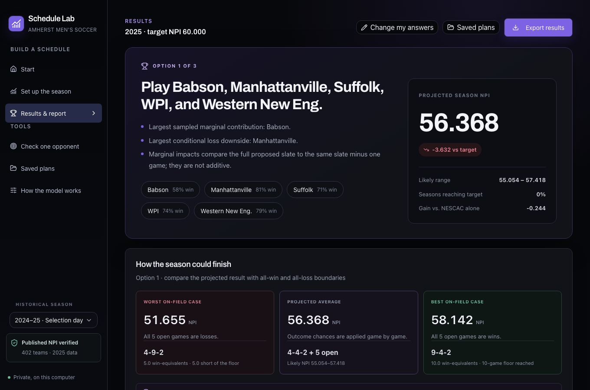

# NCAA DIII Schedule Optimization & Simulation Platform

[Open the hosted app](https://ncaa-schedule-lab.onrender.com)

A full-stack planning tool for comparing five-game nonconference schedules for Amherst men's soccer. The application models wins, ties, and losses, recalculates NPI across the Division III schedule graph, and ranks schedule options under user-defined constraints.

The 2025 validation set contains 402 rated teams and 3,528 eligible games. The division solver reproduces published 2025 NPI values within 0.001 from multiple starting seeds.

## Stack

Python, NumPy, React, TypeScript, Vite, Gunicorn, Render

## Engineering highlights

- Implements division-wide iterative NPI recalculation rather than treating opponent ratings as fixed inputs.
- Uses Monte Carlo simulation to rank five-game schedule options under win, tie, and loss uncertainty.
- Supports opponent availability, travel, dates, cost, required opponents, preferred opponents, and target NPI constraints.
- Reproduces published 2025 NPI values across 402 teams and 3,528 games within 0.001.
- Uses historical seasons to estimate matchup strength while keeping recursive NPI calculations season-specific.
- Keeps simulation jobs isolated by browser session and supports cancellation for long-running comparisons.
- Persists planning scenarios in the browser and supports spreadsheet, JSON, and printable report export.



## What the app does

- Compares named opponents or NPI/rank bands.
- Shows the effect of a win, tie, or loss against one opponent.
- Ranks five-game schedules by projected season NPI.
- Tracks each schedule against an editable target NPI.
- Supports favorite, toss-up, underdog, and custom matchup assumptions.
- Filters by required, preferred, unavailable, date, travel, and cost inputs.
- Saves and reopens planning scenarios in the current browser.
- Uses the current record and completed opponents rather than treating identical W-L-T records as equivalent.
- Models penalty-kick advancement as an NPI tie where applicable.
- Shows projected averages, high/low scenarios, and likely ranges for schedule risk.

## NPI model

For one game:

```text
base value = 0.15 × result value + 0.85 × opponent NPI
quality win bonus = 0.75 × (opponent NPI − 54)
```

The result value is 100 for a win and 0 for a loss. A tie splits the win and loss components. Quality-win bonus applies only to wins over opponents above 54 NPI.

Season NPI is not a simple average. Win and loss components are sorted by game value, retained according to the NCAA aggregation rules, and combined into the team's season rating. Because every opponent's rating also depends on its opponents, the solver updates the entire division repeatedly until the maximum rating change falls below the convergence tolerance.

## Historical validation

The reviewed fixtures are stored in `tests/data/`:

| File | Use |
|---|---|
| `ncaa_2025_11_09_division.json` | 2025 selection-day division snapshot |
| `ncaa_2024_10_27_division.json` | 2024 published NPI snapshot |
| `ncaa_2023_historical_division.json` | 2023 retrospective reconstruction |
| `ncaa_2022_historical_division.json` | 2022 retrospective reconstruction |
| `historical_probability_models.json` | Saved cross-season outcome fit |

The 2025 fixture contains 402 rated teams and 3,528 eligible games. The solver reproduces every published NPI within 0.001 from several starting seeds.

Older seasons are used for matchup-strength estimation, not mixed into the current season's recursive NPI calculation. A 50/30/20 blend of the latest three seasons improved out-of-time log loss from 0.8701 to 0.8652 for 2024 and from 0.9146 to 0.8945 for 2025.

## Comparison modes

- **Quick** screens a broader pool, then fully converges the leading shortlist.
- **Standard** evaluates a larger simulation sample and shortlist.
- **Thorough** fully evaluates the widest candidate set for final review.

Final schedule projections always use division-wide convergence. Individual game effects should not be added together because NPI is recursive and season aggregation can exclude some results.

## Run locally

Requirements: Python 3.11+, Node.js 22.13+, and npm.

```bash
cd web
npm ci
npm run build
cd ..
python3 scripts/launch_app.py
```

For frontend development:

```bash
python3 -m npi_model.app_server
```

```bash
cd web
npm run dev
```

## Tests

```bash
python -m unittest discover -s tests -v
cd web && npm run build
```

Tests cover the game formula, season aggregation, division convergence, schedule simulation, ranking, historical seasons, API validation, session isolation, cancellation, and deployment checks.

## Project layout

```text
npi_model/   NPI calculation, simulation, optimization, and API
scripts/     data import, historical rebuild, and local launcher
tests/       regression tests and reviewed historical fixtures
web/         React interface
examples/    sample planner inputs
```
